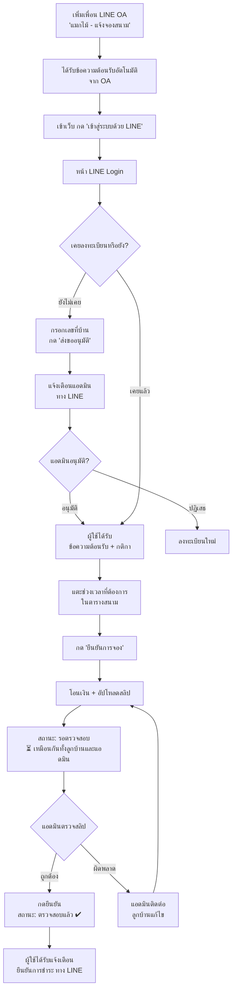

# 🎾 คู่มือการใช้งานโปรแกรมจองสนามเทนนิส หมู่บ้านแมกไม้

> เว็บไซต์: https://chumphola-coder.github.io/makmai-tennis-v2/
> อัปเดตล่าสุด: 2026-09-12 (เวอร์ชันสถานะเดียวกันทั้งหมด + รองรับติดตั้งเป็นแอป)

---

## ภาพรวมระบบ

โปรแกรมนี้ให้ลูกบ้านล็อกอินด้วยบัญชี **LINE** ของตัวเอง จองสนามเทนนิสออนไลน์ อัปโหลดสลิปโอนเงินเอง
และรับแจ้งเตือนสถานะต่างๆ ผ่าน LINE OA โดยอัตโนมัติ ไม่ต้องติดต่อแอดมินด้วยตัวเองในขั้นตอนปกติ



---

## 1. การลงทะเบียน (ครั้งแรกเท่านั้น)

0. **(ก่อนอื่น) เพิ่มเพื่อน LINE OA "แมกไม้ - แจ้งจองสนาม"** ตามลิงก์ https://line.me/R/ti/p/@194zuzqi ก่อน — ถ้าไม่เพิ่มเพื่อน จะ**ไม่ได้รับแจ้งเตือนใดๆ เลย** แม้จะลงทะเบียน/จองสำเร็จในเว็บแล้วก็ตาม หลังเพิ่มเพื่อนจะได้รับข้อความต้อนรับอัตโนมัติจาก OA ทันที (ดูข้อความเต็มในหัวข้อ 6 ด้านล่าง)
1. เข้าเว็บไซต์ → กด **"เข้าสู่ระบบด้วย LINE"**
2. ยินยอมสิทธิ์ที่ LINE ขอ (ครั้งแรกเท่านั้น)
3. ถ้ายังไม่เคยลงทะเบียน ระบบจะเด้งหน้าต่าง **"ลงทะเบียนบ้านของคุณ"** ให้กรอก **เลขที่บ้าน** อัตโนมัติ (พิมพ์แค่ตัวเลขหลัง 125/ เช่นบ้านเลขที่ 125/382 ให้พิมพ์แค่ **382** ระบบมี "125/" ให้อยู่แล้วหน้าช่องกรอก ไม่ต้องพิมพ์ซ้ำ)
4. กด **"ส่งขออนุมัติ"** → ระบบส่งแจ้งเตือนไปหาแอดมินทาง LINE ทันที
5. รอแอดมินกดอนุมัติ (ปกติแอดมินจะเห็นแจ้งเตือนและอนุมัติได้ตลอดเวลา)
6. เมื่อได้รับอนุมัติ จะได้รับ **ข้อความต้อนรับทาง LINE** อธิบายกติกาการจอง/การชำระเงินทั้งหมดอัตโนมัติ

> ⚠️ เลขที่บ้านต้องมีอยู่ในระบบทะเบียนบ้านแล้วเท่านั้น ถ้าพิมพ์เลขที่บ้านที่ไม่มีในระบบจะขึ้น
> "ไม่พบเลขที่บ้านนี้ในระบบ" — ติดต่อแอดมินหากคิดว่าเลขที่บ้านควรมีอยู่แต่ระบบไม่พบ

---

## 2. การจองสนาม (ทำได้ทุกวันหลังลงทะเบียนผ่านแล้ว)

### ขั้นตอน
1. เลือกวันที่ต้องการจากปฏิทิน/ปุ่มวันที่ด้านบนตารางสนาม
2. **แตะที่ช่วงเวลาที่ว่าง** ในตารางสนามโดยตรง (สีเขียว = ว่าง)
3. เลือกได้สูงสุด **2 ชั่วโมงต่อการจอง 1 ครั้ง** (ต้องเป็นชั่วโมงต่อเนื่องกัน)
4. เมื่อเลือกครบ ระบบจะแสดงกล่องสรุปด้านล่าง (เลื่อนหน้าจอขึ้นให้อัตโนมัติบนมือถือ) แสดงยอดรวมที่ต้องชำระ
5. กด **"ยืนยันการจอง"**
6. โอนเงินตามยอดที่แสดง แล้ว**อัปโหลดสลิปการโอนเงิน**แนบไปกับการจองนั้น


### หลังอัปโหลดสลิป
- สถานะจะเปลี่ยนเป็น **"⏳ รอตรวจสอบ"** ทันที (สีเหลืองอำพัน) เห็นเหมือนกันทั้งตัวลูกบ้านเองและแอดมิน — ใช้สนามได้ทันทีโดยไม่ต้องรอแอดมินตรวจสอบก่อน (ดู "นโยบายการชำระเงิน" ด้านล่าง)
- เมื่อแอดมินตรวจสลิปแล้วกดยืนยัน สถานะจะเปลี่ยนเป็น **"✔ ตรวจสอบแล้ว"** (สีฟ้า) — สถานะนี้เหมือนกันสำหรับทุกคน ไม่เฉพาะแอดมินอีกต่อไป
- สามารถ**เพิ่ม/เปลี่ยนสลิปใหม่ได้ตลอดเวลา** ไม่จำกัดจำนวนครั้ง แม้เวลาเล่นจะผ่านไปแล้วก็ตาม โดยแตะที่รายการจองนั้นอีกครั้ง แล้วเลือก **"+ เพิ่มสลิปใหม่"**
- บนมือถือ ปัดซ้าย/ขวา/ลง (ทิศทางไหนก็ได้) บนหน้าต่างดูสลิปเพื่อปิดหน้าต่างได้เลย ไม่ต้องกดปุ่ม "ปิดหน้าต่าง"

---

## 3. กติกา/เงื่อนไขการจอง

| หัวข้อ | เงื่อนไข |
|---|---|
| จำนวนชั่วโมงต่อการจอง | สูงสุด **2 ชั่วโมง** ต่อการจอง 1 ครั้ง (ต้องต่อเนื่องกัน) |
| จองล่วงหน้า (แจ้งล่วงหน้า ≥24 ชม.) | สูงสุด **3 ครั้งต่อสัปดาห์** (จันทร์–อาทิตย์) ต่อบ้าน |
| Walk-in (แจ้งล่วงหน้า <24 ชม.) | ได้ครั้งละ **1 รายการต่อบ้าน** เท่านั้น จนกว่ารายการนั้นจะผ่านเวลาเล่นไปแล้วจึงจองครั้งถัดไปได้ |
| จองล่วงหน้าได้ถึงเมื่อไหร่ | ถึง **วันอาทิตย์ของสัปดาห์หน้า** เท่านั้น (ไม่ใช่แบบนับ 7 วันหมุนไปเรื่อยๆ) |
| ค่าบริการ | 06:00–18:00 = ฿100/ชม. · 18:00–21:00 = ฿150/ชม. |

---

## 4. นโยบายการชำระเงิน — เล่นได้ทันที แอดมินตรวจสอบ/กระทบยอดภายหลัง

- หลักการสำคัญ: **อัพโหลดสลิปเมื่อไหร่ = ใช้สนามได้ทันที** ไม่ต้องรอแอดมินตรวจสอบก่อน — สถานะจะขึ้นเป็น "⏳ รอตรวจสอบ" ทันที
- **แอดมินจะตรวจสอบยอดเงินทุกรายการภายหลัง** เมื่อตรวจแล้วกดยืนยัน สถานะจะเป็น "✔ ตรวจสอบแล้ว"
- **หากพบว่ายอดชำระไม่ถูกต้อง** (เช่น ยอดไม่ครบ) แอดมินจะ**ติดต่อกลับเป็นรายกรณีภายหลัง** ไม่ใช่การบล็อกการจองหรือการใช้สนามแต่อย่างใด
- **แอดมินไม่จำเป็นต้องกดยืนยันทุกรายการเพื่อให้ลูกบ้านจองได้** — การจองใช้งานได้ปกติตั้งแต่อัปโหลดสลิปแล้ว ปุ่ม "ยืนยัน" ของแอดมินเป็นแค่การ**ทำเครื่องหมายว่าตรวจสลิปแล้ว** เพื่อติดตามงานของแอดมินเอง

### ⏰ ถ้าไม่อัปโหลดสลิปเลย (สำคัญ)
- ต้องอัปโหลดสลิปภายใน **4 ชั่วโมง** หลังจองมิฉะนั้นระบบจะ**ลบการจองนี้โดยอัตโนมัติ**
- **แต่ถ้าอัปโหลดสลิปแล้ว (ไม่ว่าจะถูกหรือผิด ยอดตรงหรือไม่ตรง)** การจองนั้นจะ**ไม่ถูกลบอีกต่อไป** ไม่ว่าจะผ่านไปกี่ชั่วโมง หรือเวลาเล่นผ่านไปแล้วก็ตาม

---

## 5. ฝั่งแอดมิน — การตรวจสอบและยืนยันการชำระ

1. เปิดรายการจอง (ตาราง "ประวัติการจองรายสัปดาห์" หรือแตะที่ช่องเวลาในตารางสนาม)
2. จะเห็นป้ายสถานะ 2 ชนิดคู่กัน:
   - **ป้ายยอดเงิน** (ค้างชำระ / จ่ายแล้ว / ยอดไม่ครบ / ชำระเกิน) — มาจากยอดสลิปเทียบราคาที่ต้องจ่าย
   - **ป้ายตรวจสอบของแอดมิน** — `⏳ รอตรวจสอบ` (สีเหลือง) หรือ `✔ ตรวจสอบแล้ว` (สีเขียว) — เห็นเฉพาะแอดมินเท่านั้น
3. แตะเปิดดูรูปสลิป ตรวจสอบยอดเทียบกับที่ต้องชำระ
4. ถ้าตรง กด **"🔍 ตรวจสลิปแล้ว กดยืนยัน"** → สถานะเปลี่ยนเป็น `✔ ตรวจสอบแล้ว` และ**ส่งข้อความแจ้งเตือนยืนยันการชำระให้ลูกบ้านทาง LINE ทันที** (ยืนยันได้แม้เวลาเล่นผ่านไปแล้วก็ยังส่งแจ้งเตือนตามปกติ)
5. ถ้ายอดไม่ตรง/สลิปผิด แอดมิน**ติดต่อลูกบ้านโดยตรง**เพื่อแก้ไข (ไม่ใช่หน้าที่ของระบบอัตโนมัติ)


> หมายเหตุ: รายการที่นำเข้าจากระบบเก่า (import) จะถูกทำเครื่องหมายเป็น `✔ ตรวจสอบแล้ว` ให้อัตโนมัติทั้งหมด
> ไม่ต้องไล่ตรวจย้อนหลัง — ป้าย "รอตรวจสอบ" จะขึ้นเฉพาะรายการที่จองผ่านระบบจริงเท่านั้น

### 📊 การตรวจสอบยอดรวมรายเดือน (แทนการตรวจสลิปทีละใบ)

เนื่องจากบัญชีธนาคารที่ใช้รับเงินเป็นบัญชีที่ใช้สำหรับจองสนามเทนนิสโดยเฉพาะ แอดมินสามารถ:
1. เปิด **"📊 รายงาน"** ในเว็บ → ดู **"รายได้เดือนนี้"** (คำนวณจากรายการที่มีสลิปแนบเท่านั้น)
2. เทียบกับยอดรวมในสเตทเมนต์ธนาคารเดือนเดียวกัน
3. **ถ้ายอดตรงกัน** → ไม่ต้องไล่ตรวจสลิปทีละใบ
4. ถ้ายอดไม่ตรง → ค่อยไล่ดูรายการที่ยัง `⏳ รอตรวจสอบ` เพื่อหาความคลาดเคลื่อน

---

## 6. ข้อความที่ระบบจะส่งถึงท่านทาง LINE (ข้อความเต็มทุกขั้นตอน)

ลำดับข้อความตั้งแต่ต้นจนจบของการใช้งาน — เก็บข้อความจริงทุกคำไว้ในคู่มือนี้เพื่ออ้างอิง:

### ขั้นที่ 0 — ประกาศให้เพิ่มเพื่อน LINE OA (ส่งครั้งเดียวตอนเปิดระบบ ไม่ใช่ข้อความอัตโนมัติจากโปรแกรม)

ก่อนใช้งาน ลูกบ้านทุกคนต้อง**เพิ่มเพื่อน LINE OA "แมกไม้ - แจ้งจองสนาม"** ก่อน ไม่เช่นนั้นจะไม่ได้รับการแจ้งเตือนสถานะใดๆ เลย ข้อความประชาสัมพันธ์ที่ส่งผ่านไลน์กลุ่มหมู่บ้าน (ไม่ใช่ระบบส่งอัตโนมัติ):

```
📢 แจ้งเตือนถึงลูกบ้านทุกท่าน

ตอนนี้ระบบจองสนามเทนนิสออนไลน์ของหมู่บ้านแมกไม้ ได้เปิดใช้งาน LINE OA
สำหรับส่งแจ้งเตือนสถานะการจอง/การชำระเงินโดยเฉพาะแล้วค่ะ

เพื่อให้ท่านได้รับแจ้งเตือน (เช่น ยืนยันการชำระเงิน, อนุมัติลงทะเบียน)
กรุณาเพิ่มเพื่อน LINE OA ตัวใหม่นี้ด้วยนะคะ 🙏

👉 เพิ่มเพื่อนที่นี่: https://line.me/R/ti/p/@194zuzqi
(หรือสแกน QR Code ที่แนบมา)

📌 OA นี้ใช้ส่งแจ้งเตือนอัตโนมัติเท่านั้น ไม่มีเจ้าหน้าที่คอยตอบแชทค่ะ
📌 จองสนามได้ที่: https://chumphola-coder.github.io/makmai-tennis-v2/

ขอบคุณค่ะ 🎾
```

### ขั้นที่ 0.5 — ทันทีที่เพิ่มเพื่อน LINE OA สำเร็จ ลูกบ้านจะได้รับข้อความต้อนรับอัตโนมัตินี้จาก LINE OA เอง (ตั้งค่าไว้ใน LINE Official Account Manager ไม่ใช่ข้อความที่ส่งจากโค้ดโปรแกรม)

```
สวัสดีค่ะ 🎾 ยินดีต้อนรับสู่ LINE OA ระบบแจ้งเตือนการจองสนามเทนนิส หมู่บ้านแมกไม้

OA นี้ใช้ส่งแจ้งเตือนสถานะการจอง/การชำระเงินเท่านั้นค่ะ (ไม่มีเจ้าหน้าที่คอยตอบแชท)

📌 จองสนามได้ที่: https://chumphola-coder.github.io/makmai-tennis-v2/
📌 หากยังไม่เคยใช้งาน: กดลิงก์ด้านบน แล้วเข้าสู่ระบบด้วยบัญชี LINE ของคุณ จากนั้นกรอกเลขที่บ้านเพื่อขออนุมัติ (ครั้งแรกเท่านั้น - พิมพ์แค่ตัวเลขหลัง 125/ เช่น 382 ไม่ต้องพิมพ์ "125/" ซ้ำ) เมื่อแอดมินกดอนุมัติแล้วจะเริ่มจองได้ทันที
📌 สอบถามเพิ่มเติม ติดต่อนิติบุคคลหมู่บ้านแมกไม้ได้ตามช่องทางปกติค่ะ
```

> แก้ไขข้อความนี้ได้ที่ LINE Official Account Manager → การตั้งค่า → ข้อความทักทาย (Greeting message)

### ขั้นที่ 1 — ลูกบ้านส่งคำขอลงทะเบียน → แอดมินทุกคนได้รับข้อความนี้ทาง LINE

```
🔔 มีคำขอลงทะเบียนใหม่
บ้านเลขที่ {เลขที่บ้าน} ({ชื่อเจ้าของบ้าน})
กรุณาเข้าเว็บเพื่ออนุมัติ
```

### ขั้นที่ 2 — แอดมินกดอนุมัติ → ลูกบ้านที่ได้รับอนุมัติได้รับข้อความต้อนรับเต็มนี้ทาง LINE

```
🎾 ยินดีต้อนรับสู่ระบบจองสนามเทนนิสออนไลน์ หมู่บ้านแมกไม้

บัญชีของคุณได้รับการอนุมัติแล้ว สามารถจองสนามได้ทันที

📌 วิธีจองสนาม
1. เข้าเว็บและเลือกวันที่ แตะที่ช่องเวลาที่ต้องการ (สูงสุด 2 ชั่วโมงต่อการจอง 1 ครั้ง)
2. กด "ยืนยันการจอง" แล้วโอนเงินตามยอดที่แสดง
3. อัพโหลดสลิปการโอนเงินแนบไปกับการจองนั้น

💰 การชำระเงินและสถานะการจอง
ท่านสามารถใช้สนามได้ทันทีหลังอัพโหลดสลิป ไม่ต้องรอแอดมินตรวจสอบก่อน โดยสถานะการจองจะเปลี่ยนสีตามลำดับนี้:
🔴 ค้างชำระ = ยังไม่อัพโหลดสลิป
🟡 รอตรวจสอบ = อัพโหลดสลิปแล้ว รอแอดมินตรวจสอบ
🔵 ตรวจสอบแล้ว = แอดมินตรวจสอบและยืนยันเรียบร้อย
แอดมินจะตรวจสอบยอดเงินทุกรายการภายหลัง หากพบว่ายอดชำระไม่ถูกต้องจะติดต่อท่านกลับเป็นรายกรณี กรุณาโอนเงินและอัพโหลดสลิปตามจริงทุกครั้ง ตรวจสอบสถานะการจองของท่านได้เองที่หน้าเว็บตลอดเวลา

⏰ หลังจากจองแล้ว ต้องอัพโหลดสลิปภายใน 4 ชั่วโมง มิฉะนั้นระบบจะยกเลิกการจองนี้โดยอัตโนมัติ สามารถเปลี่ยน/เพิ่มสลิปใหม่ได้ตลอดเวลาก่อนถึงเวลาเล่น โดยแตะที่รายการจองนั้นอีกครั้ง

📋 กติกาการจอง
- จองล่วงหน้าได้สูงสุด 3 ครั้งต่อสัปดาห์ (จ.-อา.) สำหรับการแจ้งล่วงหน้าอย่างน้อย 24 ชม.
- Walk-in (แจ้งล่วงหน้าน้อยกว่า 24 ชม.) ได้ครั้งละ 1 รายการต่อบ้าน จนกว่าจะผ่านไปแล้วจึงจองครั้งถัดไปได้
- สูงสุด 2 ชั่วโมงต่อการจอง 1 ครั้ง
- จองล่วงหน้าได้ถึงวันอาทิตย์ของสัปดาห์หน้าเท่านั้น

หากมีข้อสงสัยเพิ่มเติม ติดต่อนิติบุคคลหมู่บ้านแมกไม้ได้ตามช่องทางปกติค่ะ 🙏
```

### ขั้นที่ 3 — ลูกบ้านจอง + อัปโหลดสลิป → สถานะเปลี่ยนเป็น "⏳ รอตรวจสอบ" ในเว็บทันที

*(ไม่มีข้อความ LINE ส่งในขั้นตอนนี้ — ดูสถานะได้เองในเว็บโดยตรง)*

### ขั้นที่ 4 — แอดมินตรวจสลิปแล้วกดยืนยัน → เจ้าของการจองนั้นได้รับข้อความนี้ทาง LINE

```
✅ ยืนยันการชำระเงินเรียบร้อย
การจองสนามเทนนิส วันที่ {วันที่} เวลา {เวลา}
ขอบคุณที่ใช้บริการครับ
```

---

### ตารางสรุปสั้นๆ

| เหตุการณ์ | ผู้รับ | มีข้อความ LINE ไหม |
|---|---|---|
| ประกาศเปิดใช้ LINE OA ใหม่ (ครั้งเดียว) | ลูกบ้านทุกคน (ผ่านกลุ่มไลน์หมู่บ้าน) | ✅ (ข้อความขั้นที่ 0 ด้านบน) |
| ลูกบ้านส่งคำขอลงทะเบียน | แอดมินทุกคน | ✅ (ข้อความขั้นที่ 1) |
| แอดมินอนุมัติการลงทะเบียน | ลูกบ้านที่ได้รับอนุมัติ | ✅ (ข้อความขั้นที่ 2) |
| ลูกบ้านจอง/อัปโหลดสลิป | - | ❌ ไม่มี ดูสถานะเองในเว็บ |
| แอดมินกดยืนยันการชำระ | เจ้าของการจองนั้น | ✅ (ข้อความขั้นที่ 4) |
| แก้ไข/ลบการจอง | - | ❌ ไม่มี |

**ไม่มี** การแจ้งเตือนสำหรับ: การสร้างการจองใหม่, การอัปโหลด/เปลี่ยนสลิป, การยกเลิก/ลบการจอง — ผู้ใช้ต้องรับผิดชอบตรวจสอบสถานะการจองของตัวเองในเว็บโดยตรงสำหรับเหตุการณ์เหล่านี้

> ⚠️ ถ้าไม่ได้เพิ่มเพื่อน LINE OA "แมกไม้ - แจ้งจองสนาม" ตามขั้นที่ 0 จะไม่ได้รับข้อความใดๆ ข้างต้นเลย แม้บัญชีจะลงทะเบียน/จองสำเร็จตามปกติในเว็บก็ตาม

---

## 7. คำถามที่พบบ่อย

**Q: ถ้าลืมอัปโหลดสลิปจะเกิดอะไรขึ้น?**
A: ถ้าเกิน 4 ชั่วโมงโดยไม่มีสลิปเลย ระบบจะลบการจองอัตโนมัติ ต้องจองใหม่

**Q: อัปโหลดสลิปผิด/ยอดผิดพลาดจะแก้ไขยังไง?**
A: สามารถกด "+ เพิ่มสลิปใหม่" หรือ "ลบรูปนี้" แล้วอัปโหลดใหม่ได้เองตลอดเวลา หรือรอแอดมินติดต่อกลับหลังตรวจพบความคลาดเคลื่อน

**Q: แอดมินยังไม่กดยืนยัน จองได้ปกติไหม?**
A: ได้ปกติ 100% — การกดยืนยันของแอดมินไม่มีผลต่อสิทธิ์การใช้สนามของลูกบ้านเลย เป็นเพียงการทำบัญชีภายในของแอดมินเท่านั้น
