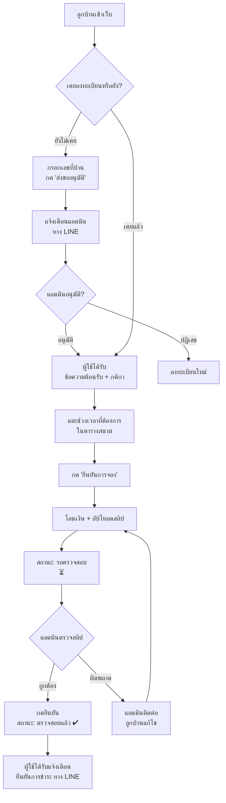
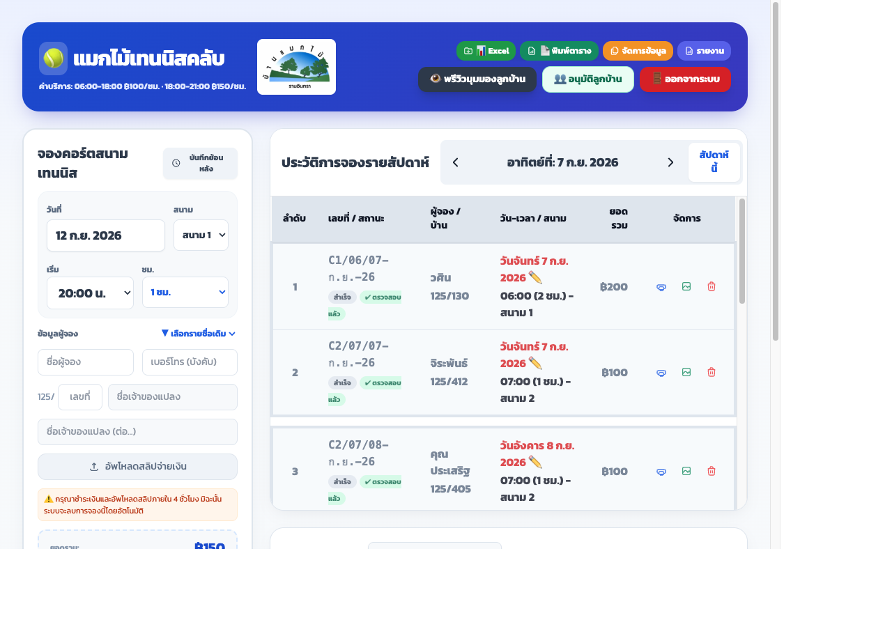
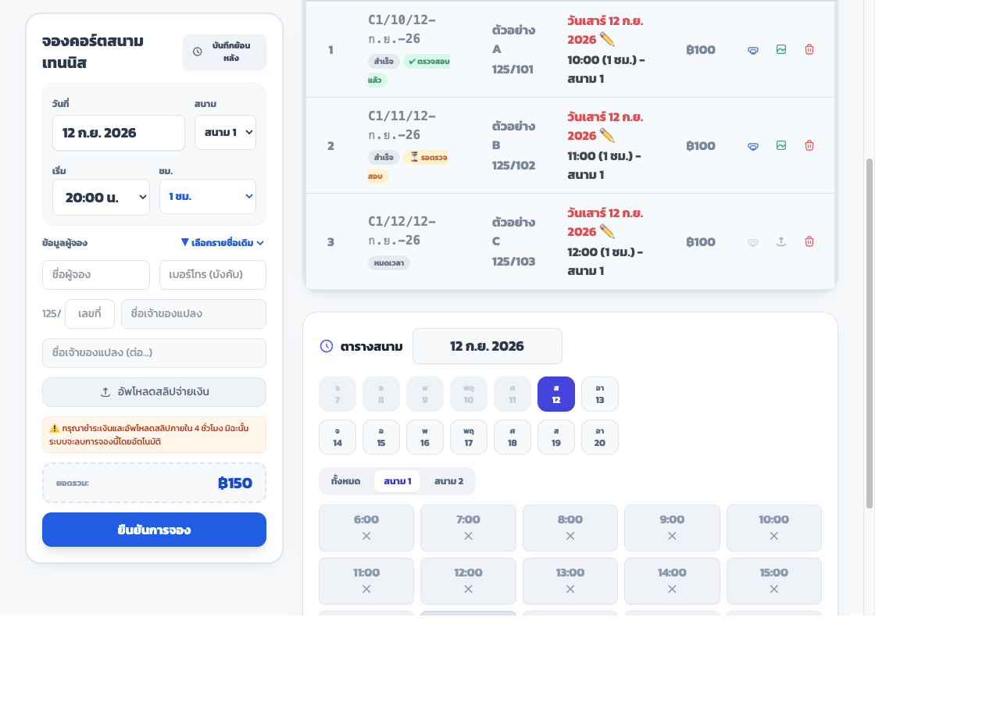

# 🎾 คู่มือการใช้งานโปรแกรมจองสนามเทนนิส หมู่บ้านแมกไม้

> เว็บไซต์: https://chumphola-coder.github.io/makmai-tennis-v2/
> อัปเดตล่าสุด: 2026-09-12

---

## ภาพรวมระบบ

โปรแกรมนี้ให้ลูกบ้านล็อกอินด้วยบัญชี **LINE** ของตัวเอง จองสนามเทนนิสออนไลน์ อัปโหลดสลิปโอนเงินเอง
และรับแจ้งเตือนสถานะต่างๆ ผ่าน LINE OA โดยอัตโนมัติ ไม่ต้องติดต่อแอดมินด้วยตัวเองในขั้นตอนปกติ

---

## 1. การลงทะเบียน (ครั้งแรกเท่านั้น)

1. เข้าเว็บไซต์ → กด **"เข้าสู่ระบบด้วย LINE"**
2. ยินยอมสิทธิ์ที่ LINE ขอ (ครั้งแรกเท่านั้น)
3. ถ้ายังไม่เคยลงทะเบียน ระบบจะเด้งหน้าต่าง **"ลงทะเบียนบ้านของคุณ"** ให้กรอก **เลขที่บ้าน** อัตโนมัติ
4. กด **"ส่งขออนุมัติ"** → ระบบส่งแจ้งเตือนไปหาแอดมินทาง LINE ทันที
5. รอแอดมินกดอนุมัติ (ปกติแอดมินจะเห็นแจ้งเตือนและอนุมัติได้ตลอดเวลา)
6. เมื่อได้รับอนุมัติ จะได้รับ **ข้อความต้อนรับทาง LINE** อธิบายกติกาการจอง/การชำระเงินทั้งหมดอัตโนมัติ

> ⚠️ เลขที่บ้านต้องมีอยู่ในระบบทะเบียนบ้านแล้วเท่านั้น ถ้าพิมพ์เลขที่บ้านที่ไม่มีในระบบจะขึ้น
> "ไม่พบเลขที่บ้านนี้ในระบบ" — ติดต่อแอดมินหากคิดว่าเลขที่บ้านควรมีอยู่แต่ระบบไม่พบ

---

## 2. การจองสนาม (ทำได้ทุกวันหลังลงทะเบียนผ่านแล้ว)

### ขั้นตอน
1. เลือกวันที่ต้องการจากปฏิทิน/ปุ่มวันที่ด้านบนตารางสนาม
2. **แตะที่ช่วงเวลาที่ว่าง** ในตารางสนามโดยตรง (สีเขียว = ว่าง)
3. เลือกได้สูงสุด **2 ชั่วโมงต่อการจอง 1 ครั้ง** (ต้องเป็นชั่วโมงต่อเนื่องกัน)
4. เมื่อเลือกครบ ระบบจะแสดงกล่องสรุปด้านล่าง (เลื่อนหน้าจอขึ้นให้อัตโนมัติบนมือถือ) แสดงยอดรวมที่ต้องชำระ
5. กด **"ยืนยันการจอง"**
6. โอนเงินตามยอดที่แสดง แล้ว**อัปโหลดสลิปการโอนเงิน**แนบไปกับการจองนั้น

### หลังอัปโหลดสลิป
- สถานะจะแสดงเป็น **"จ่ายแล้ว"** ทันที (ระบบเชื่อสลิปที่อัปโหลดโดยไม่ตรวจสอบยอดอัตโนมัติ — ดู "ระบบ Honor System" ด้านล่าง)
- สามารถ**เพิ่ม/เปลี่ยนสลิปใหม่ได้ตลอดเวลา** ไม่จำกัดจำนวนครั้ง แม้เวลาเล่นจะผ่านไปแล้วก็ตาม โดยแตะที่รายการจองนั้นอีกครั้ง แล้วเลือก **"+ เพิ่มสลิปใหม่"**
- ปัดซ้าย (swipe left) บนมือถือเพื่อปิดหน้าต่างดูสลิปได้เลย ไม่ต้องกดปุ่ม "ปิดหน้าต่าง"

---

## 3. กติกา/เงื่อนไขการจอง

| หัวข้อ | เงื่อนไข |
|---|---|
| จำนวนชั่วโมงต่อการจอง | สูงสุด **2 ชั่วโมง** ต่อการจอง 1 ครั้ง (ต้องต่อเนื่องกัน) |
| จองล่วงหน้า (แจ้งล่วงหน้า ≥24 ชม.) | สูงสุด **3 ครั้งต่อสัปดาห์** (จันทร์–อาทิตย์) ต่อบ้าน |
| Walk-in (แจ้งล่วงหน้า <24 ชม.) | ได้ครั้งละ **1 รายการต่อบ้าน** เท่านั้น จนกว่ารายการนั้นจะผ่านเวลาเล่นไปแล้วจึงจองครั้งถัดไปได้ |
| จองล่วงหน้าได้ถึงเมื่อไหร่ | ถึง **วันอาทิตย์ของสัปดาห์หน้า** เท่านั้น (ไม่ใช่แบบนับ 7 วันหมุนไปเรื่อยๆ) |
| ค่าบริการ | 06:00–18:00 = ฿100/ชม. · 18:00–21:00 = ฿150/ชม. |

---

## 4. ระบบ Honor System (ไว้วางใจ) — ไม่มีการตรวจสอบสลิปด้วย AI

- ระบบ **ไม่ตรวจสอบยอดเงินในสลิปโดยอัตโนมัติ** (ไม่มี AI สแกน) — อัปโหลดสลิปเมื่อไหร่ ระบบถือว่า "จ่ายแล้ว" ทันที
- ทางนิติบุคคลจะ **ตรวจสอบยอดรวมทั้งหมดเทียบกับ Statement ธนาคารทุกเดือนแทน** (ดู "การตรวจสอบรายเดือน" ด้านล่าง)
- **แอดมินไม่จำเป็นต้องกดยืนยันทุกรายการเพื่อให้ลูกบ้านจองได้** — การจองใช้งานได้ปกติตั้งแต่อัปโหลดสลิปแล้ว ปุ่ม "ยืนยัน" ของแอดมินเป็นแค่การ**ทำเครื่องหมายว่าตรวจสลิปแล้ว** เพื่อติดตามงานของแอดมินเอง

### ⏰ ถ้าไม่อัปโหลดสลิปเลย (สำคัญ)
- ต้องอัปโหลดสลิปภายใน **4 ชั่วโมง** หลังจองมิฉะนั้นระบบจะ**ลบการจองนี้โดยอัตโนมัติ**
- **แต่ถ้าอัปโหลดสลิปแล้ว (ไม่ว่าจะถูกหรือผิด ยอดตรงหรือไม่ตรง)** การจองนั้นจะ**ไม่ถูกลบอีกต่อไป** ไม่ว่าจะผ่านไปกี่ชั่วโมง หรือเวลาเล่นผ่านไปแล้วก็ตาม

---

## 5. ฝั่งแอดมิน — การตรวจสอบและยืนยันการชำระ

1. เปิดรายการจอง (ตาราง "ประวัติการจองรายสัปดาห์" หรือแตะที่ช่องเวลาในตารางสนาม)
2. จะเห็นป้ายสถานะ 2 ชนิดคู่กัน:
   - **ป้ายยอดเงิน** (ค้างชำระ / จ่ายแล้ว / ยอดไม่ครบ / ชำระเกิน) — มาจากยอดสลิปเทียบราคาที่ต้องจ่าย
   - **ป้ายตรวจสอบของแอดมิน** — `⏳ รอตรวจสอบ` (สีเหลือง) หรือ `✔ ตรวจสอบแล้ว` (สีเขียว) — เห็นเฉพาะแอดมินเท่านั้น
3. แตะเปิดดูรูปสลิป ตรวจสอบยอดเทียบกับที่ต้องชำระ
4. ถ้าตรง กด **"🔍 ตรวจสลิปแล้ว กดยืนยัน"** → สถานะเปลี่ยนเป็น `✔ ตรวจสอบแล้ว` และ**ส่งข้อความแจ้งเตือนยืนยันการชำระให้ลูกบ้านทาง LINE ทันที** (ยืนยันได้แม้เวลาเล่นผ่านไปแล้วก็ยังส่งแจ้งเตือนตามปกติ)
5. ถ้ายอดไม่ตรง/สลิปผิด แอดมิน**ติดต่อลูกบ้านโดยตรง**เพื่อแก้ไข (ไม่ใช่หน้าที่ของระบบอัตโนมัติ)

> หมายเหตุ: รายการที่นำเข้าจากระบบเก่า (import) จะถูกทำเครื่องหมายเป็น `✔ ตรวจสอบแล้ว` ให้อัตโนมัติทั้งหมด
> ไม่ต้องไล่ตรวจย้อนหลัง — ป้าย "รอตรวจสอบ" จะขึ้นเฉพาะรายการที่จองผ่านระบบจริงเท่านั้น

### 📊 การตรวจสอบยอดรวมรายเดือน (แทนการตรวจสลิปทีละใบ)

เนื่องจากบัญชีธนาคารที่ใช้รับเงินเป็นบัญชีที่ใช้สำหรับจองสนามเทนนิสโดยเฉพาะ แอดมินสามารถ:
1. เปิด **"📊 รายงาน"** ในเว็บ → ดู **"รายได้เดือนนี้"** (คำนวณจากรายการที่มีสลิปแนบเท่านั้น)
2. เทียบกับยอดรวมในสเตทเมนต์ธนาคารเดือนเดียวกัน
3. **ถ้ายอดตรงกัน** → ไม่ต้องไล่ตรวจสลิปทีละใบ
4. ถ้ายอดไม่ตรง → ค่อยไล่ดูรายการที่ยัง `⏳ รอตรวจสอบ` เพื่อหาความคลาดเคลื่อน

---

## 6. สรุปการแจ้งเตือนทาง LINE ทั้งหมด

| เหตุการณ์ | ผู้รับ | ข้อความ |
|---|---|---|
| ลูกบ้านส่งคำขอลงทะเบียน | แอดมินทุกคน | 🔔 มีคำขอลงทะเบียนใหม่ |
| แอดมินอนุมัติการลงทะเบียน | ลูกบ้านที่ได้รับอนุมัติ | ข้อความต้อนรับ + กติกาการจองทั้งหมด |
| แอดมินกดยืนยันการชำระ | เจ้าของการจองนั้น | ✅ ยืนยันการชำระเงินเรียบร้อย |

**ไม่มี** การแจ้งเตือนสำหรับ: การสร้างการจองใหม่, การอัปโหลด/เปลี่ยนสลิป, การยกเลิก/ลบการจอง — ผู้ใช้ต้องรับผิดชอบตรวจสอบสถานะการจองของตัวเองในเว็บโดยตรงสำหรับเหตุการณ์เหล่านี้

---

## 7. คำถามที่พบบ่อย

**Q: ถ้าลืมอัปโหลดสลิปจะเกิดอะไรขึ้น?**
A: ถ้าเกิน 4 ชั่วโมงโดยไม่มีสลิปเลย ระบบจะลบการจองอัตโนมัติ ต้องจองใหม่

**Q: อัปโหลดสลิปผิด/ยอดผิดพลาดจะแก้ไขยังไง?**
A: สามารถกด "+ เพิ่มสลิปใหม่" หรือ "ลบรูปนี้" แล้วอัปโหลดใหม่ได้เองตลอดเวลา หรือรอแอดมินติดต่อกลับหลังตรวจพบความคลาดเคลื่อน

**Q: แอดมินยังไม่กดยืนยัน จองได้ปกติไหม?**
A: ได้ปกติ 100% — การกดยืนยันของแอดมินไม่มีผลต่อสิทธิ์การใช้สนามของลูกบ้านเลย เป็นเพียงการทำบัญชีภายในของแอดมินเท่านั้น
